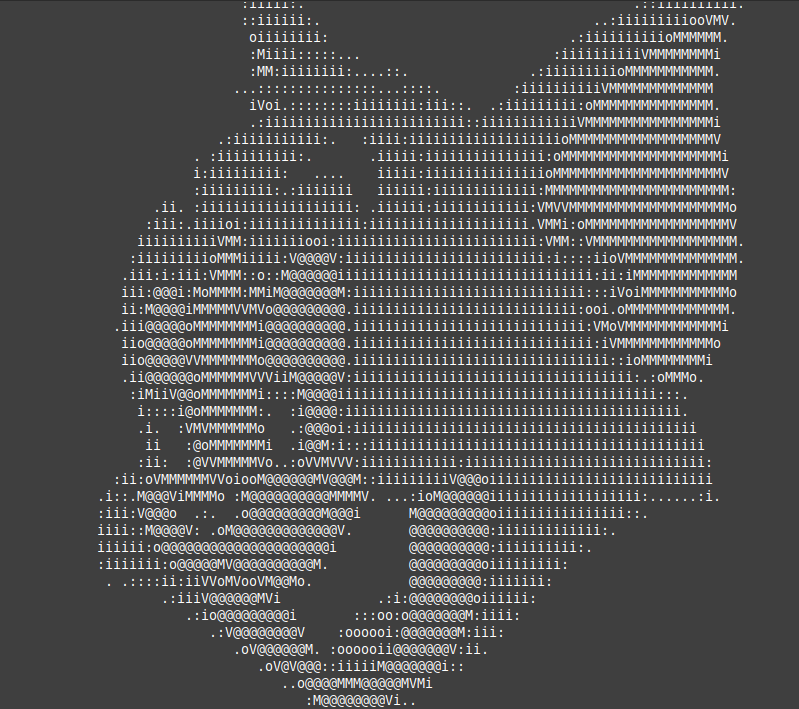
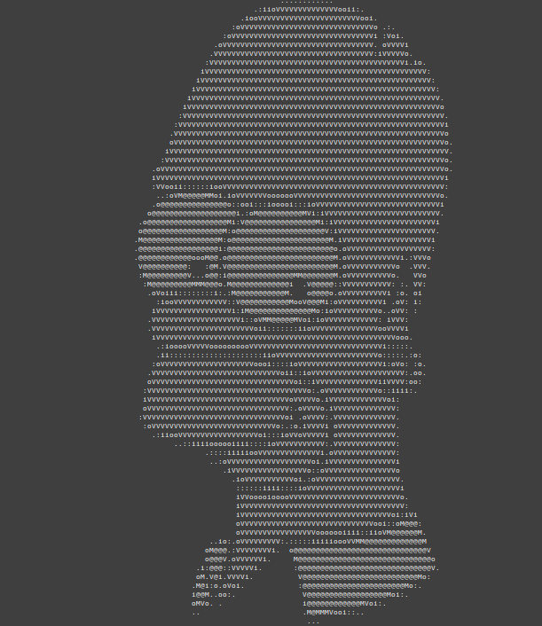

<h1>Image to ASCII Converter Using <code>stb_image</code> Library</h1>

<h2>Images</h2>

<h2>Introduction</h2>

This project uses the <code>stb_image</code> library to load and save images in C. The goal is to convert images into ASCII art.

<h2>Steps</h2>

<h3>1. Loading an Image</h3>

The goal is to load the image from disk into memory.

<strong>How to load an image:</strong>

<pre><code>unsigned char *stbi_load(char *img_path, int *width, int *height, int *channels, 0);</code></pre>
<ul>
    <li><code>img_path</code>: The path to the image file.</li>
    <li><code>width</code>, <code>height</code>: The dimensions of the image.</li>
    <li><code>channels</code>: The number of pixel values (RGB or RGBA).</li>
    <li><code>0</code>: Load only RGB, ignoring the alpha channel.</li>
</ul>

<h3>2. Looping Through Image Data</h3>

The goal is to convert each pixel in the image to ASCII code.

Each pixel in the image contains three values (RGB).  
The image pixels look like this: <b>[R, G, B][R, G, B]...</b>

<strong>Calculate pixel index:</strong>

<pre><code>index = (y * width + x) * channels;</code></pre>
<ul>
    <li><code>y * width</code>: The total number of pixels in all rows.</li>
    <li><code>+ x</code>: The current pixel position in the row.</li>
    <li><code>* channels</code>: Find the exact byte position.</li>
</ul>

<strong>Get the channel values:</strong>

The channels read the red, green, and blue values of each pixel.

<pre><code>
int red = img[index_pixel]; 
int green = img[index_pixel + 1]; 
int blue = img[index_pixel + 2];
</code></pre>
			

<strong>Convert each pixel to ASCII code:</strong>

Each image has brightness, which indicates how light or dark it appears. We need to get the brightness for each pixel and determine which ASCII character we can choose for that pixel.

<pre><code>int brightness = (red + green + blue) / 3;</code></pre>

<pre><code>for (int k = 0; k < density_size; k++) {
    if (brightness < (256 * (k + 1) / density_size)) {
        char asciiChar = density[k];
        printf("%c", asciiChar); 
        usleep(1000);
        break;
    }
}</code></pre>

<ul>
    <li><code>density:</code> An array that contains ASCII characters.</li>
    <li>It checks if the brightness is less than a calculated value based on the density size.</li>
    <li>If the condition is true, it gets the corresponding ASCII character and prints it.</li>
    <li><code>usleep(1000);</code> pauses for 1 millisecond before the next character is printed.</li>
</ul>

<h3>3. Saving an Image</h3>

We can save the image after editing each pixel to see the image in ASCII code.

<strong>How to save an image:</strong>

<pre><code>stbi_write_png("path_to_save", width, height, channels, img, width * channels);</code></pre>
<ul>
    <li><code>width</code>: The total number of values in one row of the image.</li>
    <li><code>channels</code>: The number of values per pixel (3 for RGB, 4 for RGBA).</li>
    <li><code>height</code>: The number of rows in the image.</li>
</ul>

<h3>4. Summary</h3>
<ul>
    <li>Load the image.</li>
    <li>Loop through the image data.</li>
    <li>Save the new version.</li>
</ul>

<h3>5. Compiling the Code</h3>

Use this command to compile:

<pre><code>gcc main.c -o main -lm && ./main</code></pre>

